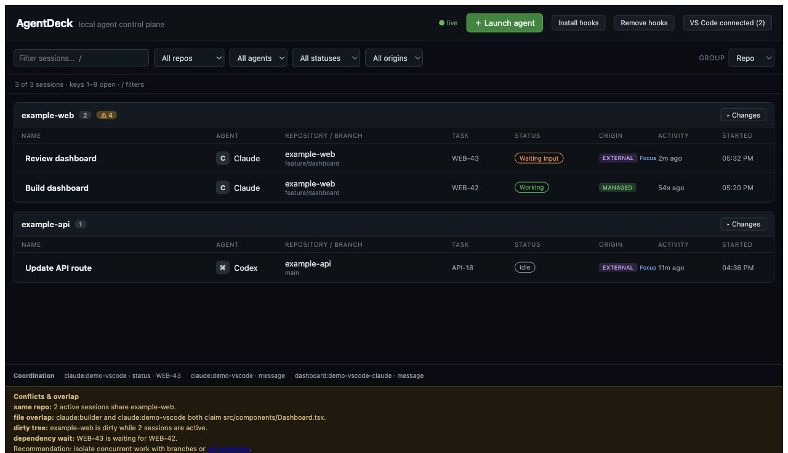
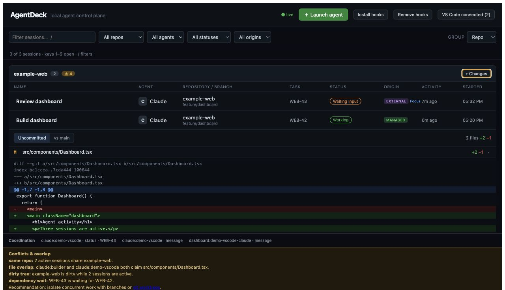
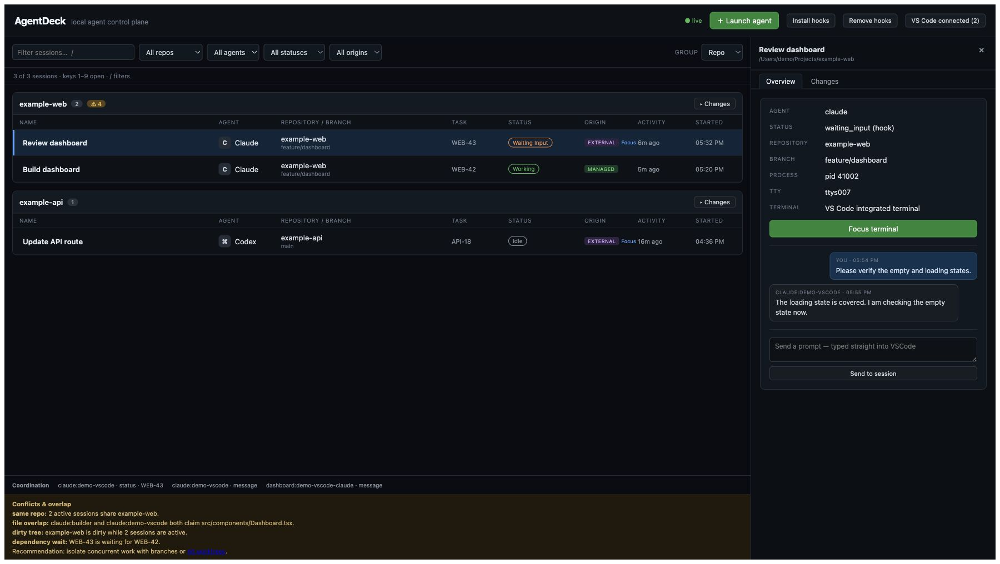
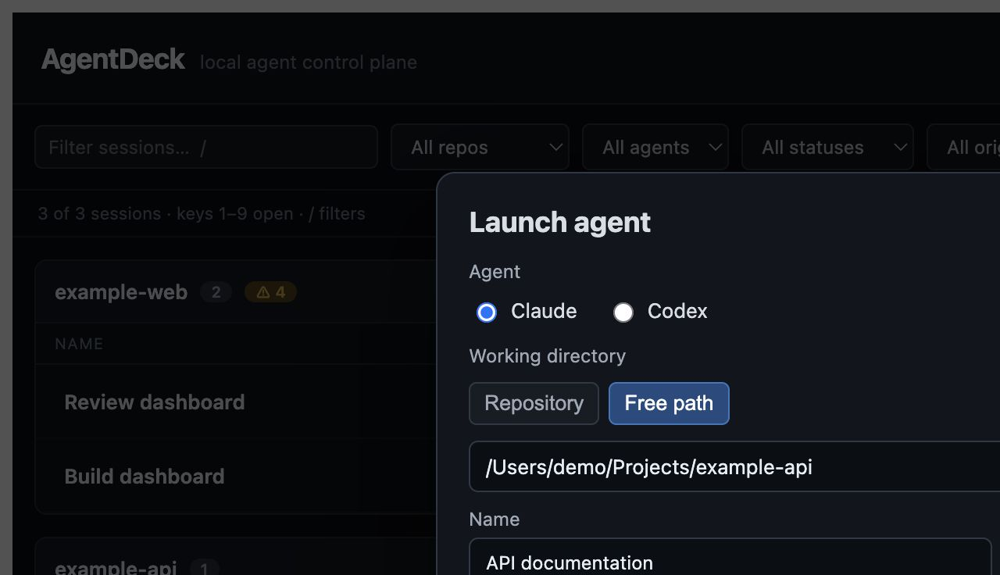

# AgentDeck

**A local-first macOS control panel for Claude Code and Codex CLI sessions.**

AgentDeck gives you one dashboard for starting agents, discovering agents that are already running, opening managed terminal sessions, tracking status, reviewing code changes as they land, focusing external terminal tabs, sending follow-up messages, and spotting risky concurrent work across repositories.

- Runs locally and binds only to `127.0.0.1`
- Supports Claude Code and Codex CLI
- Stores application state in a local SQLite database
- Licensed under the [MIT License](LICENSE)

> AgentDeck is an early MVP for macOS. Terminal.app support is verified; iTerm2 support is included but still considered experimental.

## Screenshots

### Live agent dashboard

The dashboard groups sessions by repository and shows agent type, branch, task, status, origin, activity, coordination events, conflicts, and expandable live code changes.



### Review code changes

Expand a repository or session to inspect staged, unstaged, untracked, and branch changes without leaving AgentDeck.



### Inspect and message an external session

Open an external session to see its repository, branch, process, TTY, terminal owner, conversation history, focus action, and prompt controls.



### Launch an agent

Launch Claude Code or Codex with a repository or free-form path, optional branch, label, initial prompt, and environment variables.



All screenshot data is fictional.

## What You Can Do

- See Claude Code and Codex sessions across multiple repositories in one place.
- Launch managed agents and interact with their terminal directly in the browser.
- Discover agents already running in Terminal.app, iTerm2, Cursor, or VS Code terminals.
- Focus a mapped Terminal.app, iTerm2, or VS Code integrated terminal from the dashboard.
- Send prompts or follow-up messages to supported managed and external sessions.
- Track whether an agent is starting, working, waiting for input, idle, completed, or gone.
- Watch staged, unstaged, and untracked changes land live, or compare the current branch with its base branch.
- Filter and group sessions by repository, agent, status, or origin.
- Label sessions so long-running work is easier to identify.
- Track tasks, file claims, blockers, progress, and completion through a repository-local coordination bus.
- Detect same-repository work, overlapping file claims, dirty working trees, and unmet task dependencies.
- Install and remove Claude Code hooks and Codex notifications without replacing existing hook commands.

## Features

| Area | Capability |
| --- | --- |
| Managed sessions | Launch Claude Code or Codex in a PTY, view output, type commands, resize the terminal, stop, and restart. |
| External discovery | Polls macOS processes for interactive Claude/Codex sessions and excludes desktop helpers, launch wrappers, sandboxes, and duplicate child processes. |
| Repository scanner | Scans one directory level for Git repositories and linked worktrees, including branch and dirty-tree information. |
| Safe branch selection | Can check out an existing local branch before launch, but refuses to switch branches while the working tree is dirty. |
| Live dashboard | WebSocket updates, repository grouping, search, filters, editable labels, origin badges, activity times, and status-source tooltips. |
| Code changes | Shows per-file status and line counts for uncommitted work or committed branch changes, with expandable colored diffs that refresh every five seconds. |
| Terminal focus | Maps TTYs to Terminal.app, iTerm2, and connected VS Code terminals and can bring the exact terminal to the foreground. |
| Agent status | Combines hook events, managed terminal output, process liveness, and sustained CPU activity using `hook > output > CPU` precedence. |
| Hooks | Claude Code hooks report prompts, tool usage, edits, notifications, starts, and stops. Codex notify reports completed turns. |
| Messaging | Sends directly to managed PTYs and scriptable terminal tabs; queued Claude messages can be delivered through hooks on the next turn. |
| Coordination | Uses `.agents/bus.jsonl` for claims, progress, blockers, messages, task dependencies, and completion events. |
| Generated status | Creates `.agents/STATUS.md` as a human-readable summary of active agents, claims, blockers, and recent messages. |
| Conflict awareness | Warns about multiple sessions in one repository, overlapping file claims, dirty shared trees, and unmet dependencies. |
| Persistence | Stores sessions, tasks, repositories, events, labels, and settings in SQLite under `~/.agentdeck/`. |
| Local security | Serves only on `127.0.0.1`; it is not exposed to the local network by default. |

## Requirements

- macOS
- Node.js 20 or newer
- Git
- Claude Code and/or Codex CLI installed and authenticated
- Terminal.app or iTerm2 for focus support

AgentDeck includes an `.nvmrc`. If your default shell uses an older Node version, always run `nvm use` before installing dependencies or starting the app.

## Step-by-Step Setup

### 1. Clone the repository

```bash
git clone https://github.com/sandeepsuri/agentdeck.git
cd agentdeck
```

### 2. Select the required Node version

With [nvm](https://github.com/nvm-sh/nvm-sh):

```bash
nvm use
node --version
```

The reported version must be Node 20 or newer.

### 3. Install dependencies

```bash
npm install
```

If native SQLite dependencies were previously installed under another Node major version, rebuild them after `nvm use`:

```bash
npm rebuild better-sqlite3
```

### 4. Build AgentDeck

```bash
npm run build
```

### 5. Start AgentDeck

```bash
npm start
```

You can also run the local package binary:

```bash
npx agentdeck
```

To use the `agentdeck` command from other repositories while developing from source, link the local package once:

```bash
npm link
agentdeck --help
```

### 6. Open the dashboard

Open [http://127.0.0.1:4040](http://127.0.0.1:4040).

The header should show `● live`. AgentDeck immediately scans for repositories and already-running agents, then refreshes external discovery every five seconds by default.

### 7. Allow terminal focus when requested

macOS may ask whether your terminal or Node process can control Terminal.app or iTerm2. This permission is required only for listing, focusing, or typing into external terminal tabs.

If permission was denied, open:

**System Settings → Privacy & Security → Automation**

AgentDeck continues running when Automation permission is unavailable.

### 8. Connect VS Code integrated terminals

Click **Install VS Code helper**, then reload each open VS Code window once. The bundled local extension reports terminal shell process IDs to AgentDeck so prompts and focus actions reach the exact split terminal. It connects only to AgentDeck on loopback. When connected, the header shows **VS Code connected (N)**, where `N` is the number of mapped integrated terminals.

### 9. Install hooks for richer status and messaging

From the dashboard:

1. Open a session in the target repository (or select it with the repository filter).
2. Click **Install hooks**.
3. Restart any Claude Code or Codex sessions that were already running when the hooks were installed.
4. Run a turn in the agent so AgentDeck can associate the hook identity with the discovered session.

The dashboard installer adds repository-level Claude hooks and a user-level Codex notify command. Existing hook commands are retained, timestamped backups are created, and an existing Codex notify command is chained.

You can install hooks from the CLI instead:

```bash
# Claude hooks for one repository
agentdeck install-hooks /Users/you/Projects/example-app

# Codex user-level notify hook
agentdeck install-hooks --user

# Install both in one command
agentdeck install-hooks /Users/you/Projects/example-app --user
```

Remove them symmetrically:

```bash
agentdeck uninstall-hooks /Users/you/Projects/example-app
agentdeck uninstall-hooks --user
```

## Configure Repository Discovery

Without a config file, AgentDeck derives `projectsDir` from where it was started:

- Started inside a Git repository: scans the repository's parent directory.
- Started elsewhere: scans the current directory.

AgentDeck scans exactly one directory level. To configure a fixed projects directory, create `~/.agentdeck/config.json`:

```json
{
  "port": 4040,
  "projectsDir": "/Users/you/Projects",
  "pollIntervalMs": 5000,
  "dataDir": "/Users/you/.agentdeck"
}
```

Restart AgentDeck after changing the config file.

## How to View Agents

AgentDeck displays two kinds of sessions:

### Managed sessions

Managed sessions were launched from AgentDeck. Clicking a managed row opens its browser terminal and displays **Stop** and **Restart** controls.

### External sessions

External sessions were started elsewhere and discovered from the macOS process table. Clicking an external row shows:

- Process ID
- TTY
- Repository and branch
- Status and status source
- Owning terminal application, when known
- **Focus terminal** and message controls, when supported

Terminal.app and iTerm2 sessions use macOS Automation. VS Code integrated terminals become focusable and scriptable after the bundled helper connects. Cursor terminals may still appear as `unknown`.

### Filters and keyboard shortcuts

- Type in the search box to match a session label, repository, branch, task, or agent.
- Filter by repository, Claude/Codex, status, or managed/external origin.
- Group by repository, agent, status, origin, or no grouping.
- Press `/` to focus the search box.
- Press `1` through `9` to open the corresponding visible session.

## Review Code Changes

AgentDeck can show repository changes without leaving the dashboard:

- Open a session and select its **Changes (N)** tab. `N` is the number of files with uncommitted changes. Managed sessions use **Terminal** as their other tab, while external sessions use **Overview**. The managed terminal stays connected when you switch tabs.
- When the dashboard is grouped by **Repo**, click **Changes** in a repository header to expand the viewer below that repository's session rows. You can keep multiple repository viewers open at once.

The viewer has two modes:

- **Uncommitted** combines staged, unstaged, and untracked working-tree changes.
- **vs base branch** shows committed changes on the current branch since it diverged from its base. AgentDeck resolves the base from `origin/HEAD`, then falls back to `main` or `master`.

Each file shows its Git status (`M`, `A`, `D`, `R`, or `?`) and added/deleted line counts. Click a file to expand its colored unified diff. Binary files are identified without rendering text, and very large file diffs are limited to the first 512 KB. The summary and any open file diffs refresh every five seconds so you can follow an agent's edits as they land.

## How to Start, Stop, and Restart Agents

### Start a managed agent

1. Click **Launch agent**.
2. Choose **Claude** or **Codex**.
3. Select a scanned repository or enter a free path.
4. Optionally provide a session name, existing branch, initial prompt, and environment variables.
5. Click **Launch**.
6. Click the new managed row to use the terminal in AgentDeck.

If you enter an existing branch, AgentDeck checks the repository immediately before checkout. It refuses to switch branches when any modified, staged, or untracked files are present. Leave **Existing branch** blank to keep the current branch.

### Stop a managed agent

1. Click the managed session row.
2. Click **Stop**.

AgentDeck sends `SIGTERM`, escalates to `SIGKILL` only if necessary, and removes the row after the process exits.

### Restart a managed agent

1. Click the managed session row.
2. Click **Restart**.

AgentDeck relaunches the stored launch specification with the same session label and working directory.

### Stop an external agent

AgentDeck does not own external processes, so it does not show a Stop button for them.

Preferred method:

1. Open the external session details.
2. Click **Focus terminal** when available.
3. Press `Ctrl+C` in the owning terminal.
4. Run `exit` if you also want to close the shell.

If the terminal cannot be focused, use the displayed process ID carefully:

```bash
ps -p <pid> -o pid,tty,command
kill <pid>
```

Avoid broad commands such as `pkill claude` or `pkill codex`; they can terminate unrelated sessions. The row disappears after the next discovery poll once the process is gone.

## Turn Monitoring On or Off

The **Install hooks** and **Remove hooks** buttons control enhanced monitoring and queued Claude messaging; they do not start or stop the agent process itself.

- Hooks on: richer status changes, edit claims, completed-turn messages, and queued Claude delivery.
- Hooks off: process discovery and CPU status still work, but hook-driven details are unavailable.

Open a session before clicking the hook button so its repository is targeted; the repository filter is used as the fallback when no session is open.

## Send Messages to Agents

Managed sessions expose their terminal directly in AgentDeck; type into that terminal as you would in the original CLI. External session rows provide a separate conversation panel:

- Terminal.app/iTerm2 sessions: AgentDeck types into the mapped tab through Automation.
- VS Code sessions: the companion extension sends the prompt to the exact mapped integrated terminal.
- Claude in an unknown terminal: with hooks installed and associated, the message is queued and delivered as additional context on the next prompt or session start.
- Codex in an unknown terminal: queued inbound delivery is not currently available.

Messages sent from the dashboard and supported agent replies appear in the session conversation history.

Direct prompt delivery can work before hooks are installed when AgentDeck can script the owning terminal. Capturing agent replies and richer status events requires hooks; restart any CLI sessions that were already open when the hooks were installed.

## Coordination Bus

Each observed repository can contain:

```text
.agents/
├── bus.jsonl       # append-only agent events
├── inbox.jsonl     # queued dashboard-to-Claude messages
└── STATUS.md       # generated human-readable status
```

Post coordination events from inside a Git repository:

```bash
# Claim files before editing
agentdeck post \
  --event claim \
  --task WEB-42 \
  --files src/components/Dashboard.tsx,src/styles/dashboard.css \
  -m "Starting dashboard work"

# Report progress
agentdeck post --event progress --task WEB-42 -m "Table and filters complete"

# Report a blocker
agentdeck post --event blocked --task WEB-42 --blockers API-7 -m "Waiting for schema"

# Release files or finish the task
agentdeck post --event release --task WEB-42 --files src/components/Dashboard.tsx
agentdeck post --event done --task WEB-42 -m "Dashboard complete"
```

AgentDeck infers the repository root from the current working directory. Events are shown live in the dashboard and regenerate `.agents/STATUS.md`.

## Understanding Status

| Status | Meaning |
| --- | --- |
| `starting` | A managed CLI process has launched but is not ready yet. |
| `working` | Recent hook, terminal output, or sustained CPU activity indicates active work. |
| `waiting_input` | The agent is waiting for approval, input, or another user action. |
| `idle` | The process is alive but is not currently doing meaningful work. |
| `completed` | The tracked task or turn has completed. |
| `unknown` | The process is alive but AgentDeck does not have a strong status signal. |

Hover over a status chip to see whether the winning signal came from a hook, output heuristic, CPU heuristic, or process exit.

## Conflict Warnings

AgentDeck derives conflicts instead of storing them permanently:

- **same repo** — multiple active sessions share a repository.
- **file overlap** — multiple agents claim the same file.
- **dirty tree** — concurrent sessions are operating in a dirty repository.
- **dependency wait** — a task depends on another task that is not complete.

For concurrent work, prefer separate branches or Git worktrees. Automatic worktree creation is planned but is not enabled in the current launch form.

## Data and Security

- The HTTP and WebSocket server binds to `127.0.0.1` only.
- Browser requests must come from the exact loopback origin serving AgentDeck; other localhost sites are rejected.
- Code-change requests are limited to repositories already known to AgentDeck, and file paths are constrained to their repository.
- The main database is stored at `~/.agentdeck/agentdeck.db` by default.
- Database files are restricted to the current OS user, and managed-session prompts, arguments, and environment overrides are kept in memory rather than persisted.
- Repository coordination files are stored under each repository's `.agents/` directory.
- Hook installation changes `.claude/settings.json` and optionally `~/.codex/config.toml`; backups are created before edits.
- The VS Code helper accepts only loopback `ws://` or `wss://` server URLs.
- AgentDeck does not expose a network listener to other devices by default.
- Claude Code and Codex still communicate with their respective providers according to their own configuration.

Do not expose the AgentDeck port through a public proxy unless you add appropriate authentication and understand that managed sessions provide terminal access.

## Troubleshooting

### `Node.js 20 or newer is required`

```bash
cd agentdeck
nvm use
npm install
```

### SQLite reports `NODE_MODULE_VERSION` mismatch

The native module was installed under a different Node version:

```bash
nvm use
npm rebuild better-sqlite3
```

### `Cannot check out a branch: the working tree is dirty`

Git sees modified, staged, or untracked files. Inspect them with:

```bash
git status --short
```

Keep the branch field empty, commit the work, or stash it safely before requesting a checkout.

### An external session appears even though no terminal window is visible

The CLI process may still be alive in a hidden or persistent Cursor/VS Code terminal. Open the session details and inspect its PID and TTY:

```bash
ps -p <pid> -o pid,ppid,tty,lstart,command
```

### Focus is unavailable

- Confirm macOS Automation permission.
- For Terminal.app/iTerm2, confirm the session belongs to the expected tab.
- For VS Code, install the helper and reload the VS Code window once.
- Cursor integrated terminals may remain `unknown` and cannot currently be focused.

### Repositories do not appear

- Confirm `projectsDir` is correct.
- Confirm repositories are direct children of that directory.
- Confirm each repository has a `.git` directory or `.git` worktree file.

## Development

Run the development UI and API:

```bash
nvm use
npm install
npm run dev
```

- Vite UI: [http://127.0.0.1:4040](http://127.0.0.1:4040)
- Fastify API/WebSocket server: `127.0.0.1:4041`

Validate changes:

```bash
npm test
npm run typecheck
npm run build
npm pack
```

## Contributing

Issues and pull requests are welcome.

1. Fork the repository.
2. Create a focused branch.
3. Add or update tests for behavioral changes.
4. Run the validation commands above.
5. Open a pull request describing the problem, approach, and manual testing performed.

Please avoid committing personal project names, absolute user paths, API keys, captured credentials, or real terminal/session payloads in tests, documentation, and screenshots.

## License

AgentDeck is available under the [MIT License](LICENSE).
